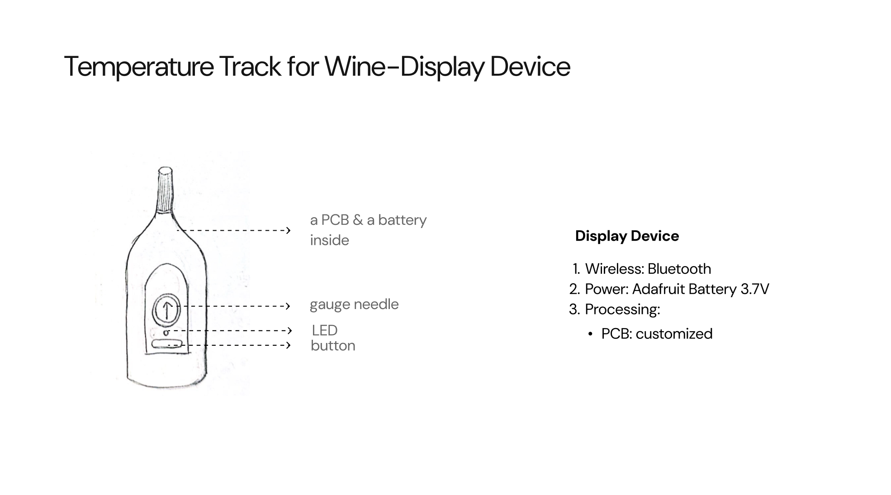

# Hardware_Final
A design that monitors the temperature in the wine storage area, helping maintain the optimal environment for wine preservation.

When the temperature rises or falls outside the optimal range, the sensing device detects the change and wirelessly sends data to the display device. The gauge needle shows the current temperature status, and if it exceeds the limits, the LED light turns on as a warning. The user can press the button to acknowledge and turn off the warning light.

1.Seonsing Device
The sensing device uses a BME280 sensor to measure temperature, which is processed by an ESP32 microcontroller on a custom PCB. Powered by a 3.7V battery, it transmits data wirelessly via Bluetooth, updating every 60 seconds.

2.Display Device
The display device receives temperature data wirelessly via Bluetooth from the sensing device. The ESP32 microcontroller processes this data and controls the gauge needle to indicate the current temperature. If the temperature exceeds the set threshold, the LED lights up as a warning. The user can press the button to acknowledge the alert and reset the LED. The system is powered by a 3.7V Adafruit battery.

3. how they connect

4.circuit diagram

